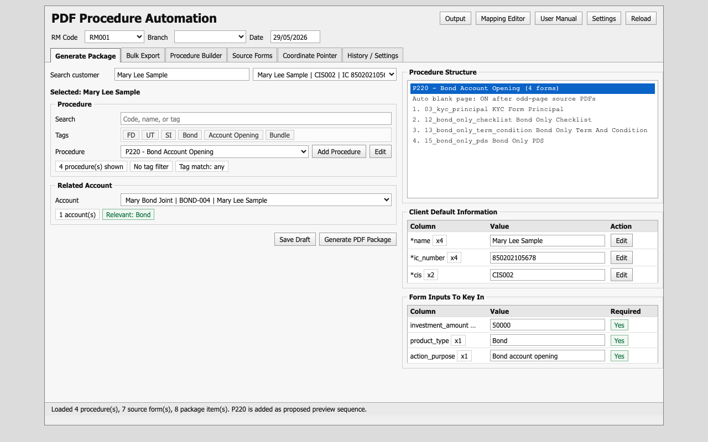
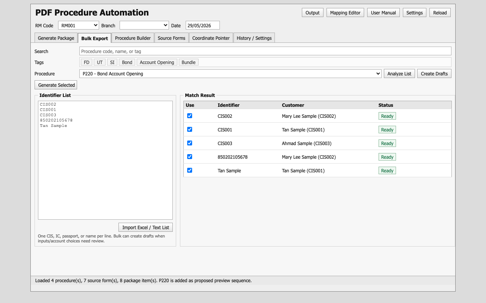
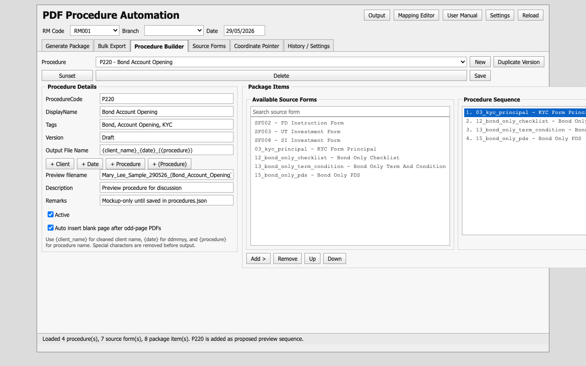
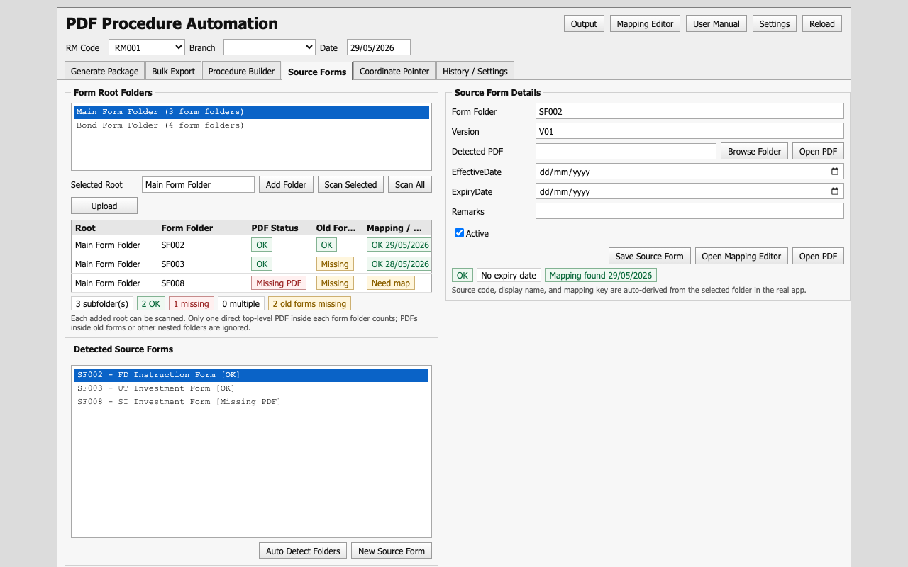
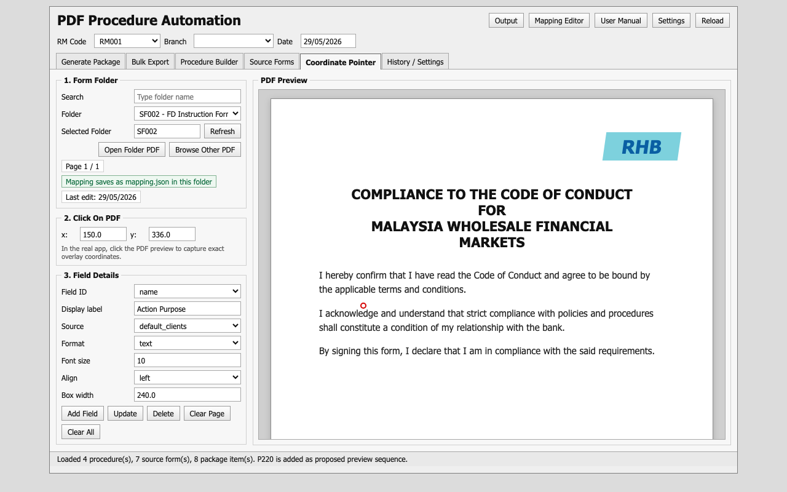
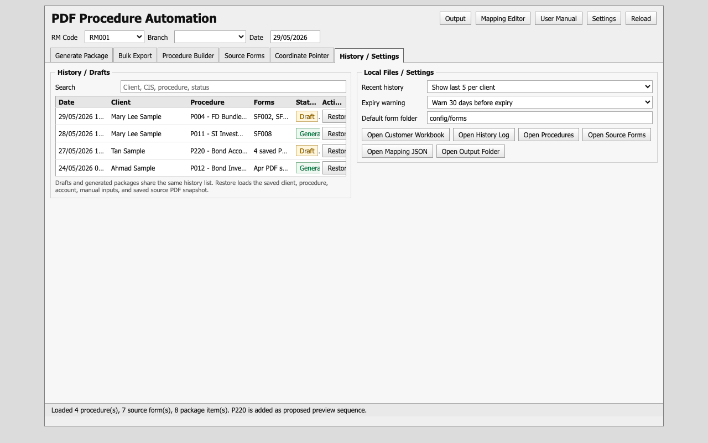

# PDF Procedure Automation User Manual

Last updated: 30 May 2026

This guide explains the daily workflow for the offline PDF Procedure Automation Tool.

The normal flow is:

`Search customer -> choose procedure -> choose related account -> key in missing form inputs -> generate PDF package -> review history`

## 1. Start The App

1. Open `FormFiller.exe`.
2. Check the top row:
   - `RM Code`
   - `Branch`
   - `Date`
3. Leave `Branch` blank if no branch should be printed.
4. Use `Output` to open the generated PDF folder.
5. Use `User Manual` to open this guide.
6. Use `Reload` after changing Excel/config/form folders.

## 2. Generate One PDF Package

1. Go to `Generate Package`.
2. Search customer by name, IC, passport, or CIS.
3. Select the correct customer from the dropdown.
4. Search/select the procedure.
   - Tags are optional filters.
   - Tag match is `Any`, so one matching tag is enough.
5. Select the related account if the procedure needs UT/Bond/SI/account information.
6. Review `Procedure Structure` to confirm the form sequence.
7. Review `Client Default Information / Form Inputs`.
   - Default Excel fields are shown only if used by the current procedure.
   - `x2`, `x4`, etc. means how many times that field is used in this procedure.
   - Non-default form inputs can be keyed in directly.
8. Click `Save Draft` if you are not ready to generate.
9. Click `Generate PDF Package` when ready.

Important:
- Expired source forms block generation.
- Forms expiring soon show a warning.
- Source folders with missing PDF or multiple direct PDFs should be corrected in `Source Forms`.

## 3. Bulk Export

Use this when preparing many customers for the same procedure.

1. Go to `Bulk Export`.
2. Search/select one procedure for the batch.
3. Paste one identifier per line:
   - CIS
   - IC
   - Passport
   - Customer name
4. Click `Analyze`.
5. Review `Match Result`.
   - `Use` means the row is selected.
   - Double-click a row to include/exclude it.
   - `Ready` means the customer matched.
   - `Need Review` means the match is not clean.
   - `Needs Input` means more details or account selection may be required.
6. Click `Create Drafts` if the rows still need manual input.
7. Click `Generate Selected` only when selected rows are ready.

Notes:
- Bulk currently uses one selected procedure for all rows.
- If different customers need different procedures, handle them in separate batches.

## 4. Procedure Builder

Use this to maintain procedure/package definitions.

1. Go to `Procedure Builder`.
2. Select an existing procedure or click `New`.
3. Set:
   - `ProcedureCode`
   - `DisplayName`
   - `Tags`
   - `Version`
   - `Output File Name`
4. Use output filename tokens:
   - `{client_name}` cleaned client name
   - `{date}` as `ddmmyy`, for example `300526`
   - `{procedure}` cleaned procedure name
5. Add source forms from the left list into the right sequence.
6. Use `Up` / `Down` to arrange the sequence.
7. Keep `Auto insert blank page after odd-page PDFs` on unless there is a reason to override it.
8. Click `Save`.

Version maintenance:
- Use `Duplicate Version` to create a new version before amending an existing procedure.
- Use `Sunset` to make an old procedure inactive.
- Use `Delete` only for cleanup where no history depends on the procedure.

## 5. Source Forms

Use this tab to manage form folders and PDF validity.

1. Go to `Source Forms`.
2. Add one or more form root folders.
3. Select a root folder.
4. Click `Scan`.
5. Review each detected subfolder:
   - `OK`: exactly one direct top-level PDF was found.
   - `Missing PDF`: no direct top-level PDF was found.
   - `Multiple PDFs`: more than one direct top-level PDF was found.
   - `Old Forms Missing`: the folder has no `old forms` subfolder.
   - `Mapping`: shows whether mapping exists and the latest mapping edit date.
6. Select a source form to edit:
   - Folder/path
   - Version
   - Effective date
   - Expiry date
   - Remarks
   - Active status
7. Click `Open Mapping Editor` to map fields for that source form.

Folder standard:
- Each form subfolder should contain exactly one current PDF directly inside the folder.
- Old PDF versions should be placed in `old forms/`.
- PDFs inside `old forms/` are ignored by the active scan.

## 6. Coordinate Pointer

Use this tab to map where each field should print on a PDF.

1. Go to `Coordinate Pointer`.
2. Search/select the form folder.
3. Open the folder PDF.
4. Click on the PDF preview to capture `x` and `y`.
5. Select the field ID / Excel field.
6. Choose source:
   - Excel sheet
   - `Session Input`
   - `Fixed Text`
   - `Auto Date`
7. Choose format, font size, alignment, and box width.
8. Click `Add Field` or `Update`.
9. Save the mapping.

Mapping storage:
- The app writes mapping to the central config for compatibility.
- The preferred current location is `mapping.json` inside the selected form folder.

## 7. History / Settings

Use this tab to find previous drafts and generated packages.

1. Go to `History / Settings`.
2. Search by client, CIS, procedure, or status.
3. Select a row.
4. Click `Open / Restore` or double-click the row.

History behavior:
- Drafts and generated packages are stored together.
- Restoring loads saved customer, procedure, account, and manual inputs.
- Generated history records include a form manifest showing which source PDFs/mappings were used.

Current limitation:
- Exact regeneration from archived old PDFs is not fully automated yet.
- If a form has changed since the original generation, the app can restore the saved inputs, but final regeneration still depends on the active catalog unless an archived replay flow is added later.

## 8. Common Checks Before Generating

Before generating important packages, confirm:

1. Customer selected is correct.
2. Related account is correct.
3. Procedure structure has the expected forms.
4. Required inputs are filled.
5. Source Forms scan has no missing/multiple active PDF issues.
6. Expiry date warnings are resolved or accepted.
7. Output folder is correct.

## 9. Troubleshooting

### Excel workbook cannot be edited

Close `clients.xlsx` and try again. The app makes backups before writing default-field edits.

### Source form cannot generate

Check `Source Forms`:
- Missing PDF
- Multiple direct PDFs
- Expired form
- Not-yet-effective form
- Missing mapping

### Field appears in wrong position

Open `Coordinate Pointer`, select the form folder, adjust the field position, and save mapping again.

### Bulk row is not ready

Create a draft first. Then restore the draft from `History / Settings` and complete the missing inputs manually.
